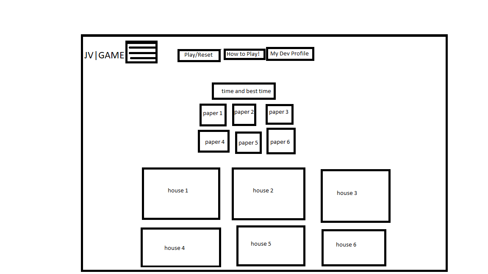

##Project Name: Project Bravo
##Date: 10/12/2025
##Objective: to deliever all the mail as quick as possible to the right houses
##Rules: drag each newspaper to the correct house, if delievered to the wrong house must try again till all newspapers are delivered

Credit: 

W3Schools- helped with functions as needed.

CodeAcedemy- taught me the things I didn't know, good reference

ChatGPT- helped debug code and made some of the javascript

Maria: collaborated with to help each other throughout the project


Page Map:
- **index.html** – Homepage of the website.

#### docs/pages/
individual site pages

- **howToPlay.html** – how to play the game


#### docs/scripts/
JavaScript file with all site behavior changes

- **game.js** – has all the games interactive parts
- **storage.js** – has strorage elements of best score

## docs/styles/
Styling sheet

- **style.css** – CSS file used to style with

## docs/images/
images used

- **newspaper.jpg**
- **WireframeOfProjectBravoGamePage.jpg**


Wireframe link: 

To view(live link): [https://chickenalfredo1121.github.io/ProjectBravo/]

#Code Snippet
this javascript randomizes the houses order

````javascript
function shuffleHousesInGrid() {
  const container = document.querySelector('.deliveryHouses');
  if (!container) return;

  const houses = Array.from(container.querySelectorAll('.house'));
  if (houses.length === 0) return;

  const shuffled = houses.sort(() => Math.random() - 0.5);
  shuffled.forEach(house => container.appendChild(house));
}
````